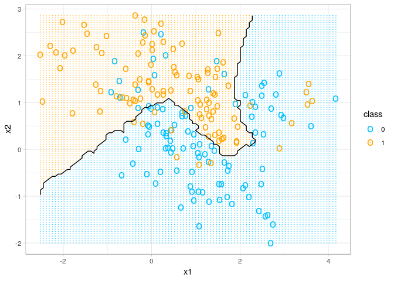
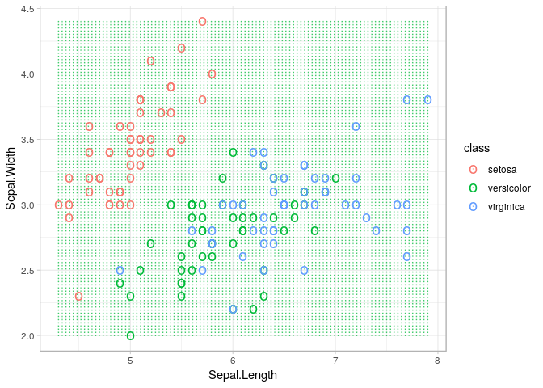
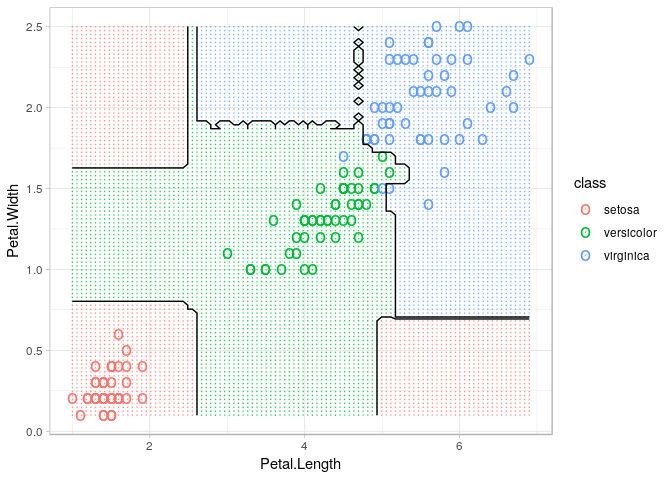

bodomisc Vignette
================
Bodo Burger
2018-08-21

-   [Plot Classification in 2 Dimensions](#plot-classification-in-2-dimensions)
    -   [Nearest neighbor](#nearest-neighbor)
    -   [Random Forest and Iris Dataset](#random-forest-and-iris-dataset)
-   [Miscellaneous Helper Functions](#miscellaneous-helper-functions)
    -   [Majority Voting for Categorical Features](#majority-voting-for-categorical-features)
    -   [Show Factor Level to Value Mapping](#show-factor-level-to-value-mapping)
    -   [System and Session Information](#system-and-session-information)
-   [Vignette help](#vignette-help)
    -   [Vignette Info](#vignette-info)
    -   [Styles](#styles)
    -   [Figures](#figures)
    -   [More Examples](#more-examples)
-   [Notes](#notes)

Plot Classification in 2 Dimensions
===================================

`PlotClassification2D()` visualizes the decision boundaries (respectively areas) of a model for a classification task in a 2-dimensional feature space.

The plot also shows the real data points and the respective class so that we can evaluate the decisions of the fitted model.

Model fitting is expected to be done via the interface of the mlr package as this allows the use of a great many models. The selected features have to be numeric to get a useful graph. The function creates a uniform grid in the 2-dimensional feature space and makes a model prediction for each grid point. For these predicitons all other numerical features are set to their mean, categorical features (factors) are set to the most frequent category (level).

Nearest neighbor
----------------

The function is inspired by the figures you can find in the 2nd chapter of "Elements of Statistical Learning". We recreate the example for the nearest-neighbor method.

``` r
library(bodomisc)
library(mlr)
library(ggplot2)
theme_set(theme_light())
library(ElemStatLearn)
me = ElemStatLearn::mixture.example
df = data.frame(x1 = me$x[,1], x2 = me$x[,2], y = factor(me$y))
tsk = makeClassifTask(data = df, target = "y")
spam.knn = train(makeLearner("classif.knn", k = 15), tsk)
plotClassification2D(spam.knn, tsk, features = c("x1", "x2"), colours = "ESL")
```



Random Forest and Iris Dataset
------------------------------

The plot is also insightful for multiclassification problems like the Iris dataset.

``` r
iris.mod.rf = train(makeLearner("classif.randomForest"), iris.task)
plotClassification2D(iris.mod.rf, iris.task, features = c("Sepal.Length", "Sepal.Width"))
```



``` r
plotClassification2D(iris.mod.rf, iris.task, features = c("Petal.Length", "Petal.Width"))
```



Miscellaneous Helper Functions
==============================

Majority Voting for Categorical Features
----------------------------------------

Show Factor Level to Value Mapping
----------------------------------

System and Session Information
------------------------------

``` r
SystemInfo()
#> ------ General -----
#>    Operating system: Ubuntu 18.04.1 LTS (Linux 4.15.0-32-generic)
#>           R version: 3.5.1 (2018-07-02) Feather Spray 
#>      User interface: RStudio (1.1.456) 
#> ------ Session -----
#>   Working directory: /home/bodo/GitRepos/bodomisc/vignettes (change it using setwd() )
#> Packages (attached): base, bodomisc, datasets, devtools, ElemStatLearn, ggplot2, graphics, grDevices, methods, mlr, ParamHelpers, stats, utils (13 packages attached)
```

------------------------------------------------------------------------

Vignette help
=============

Vignettes are long form documentation commonly included in packages. Because they are part of the distribution of the package, they need to be as compact as possible. The `html_vignette` output type provides a custom style sheet (and tweaks some options) to ensure that the resulting html is as small as possible. The `html_vignette` format:

-   Never uses retina figures
-   Has a smaller default figure size
-   Uses a custom CSS stylesheet instead of the default Twitter Bootstrap style

Vignette Info
-------------

Note the various macros within the `vignette` section of the metadata block above. These are required in order to instruct R how to build the vignette. Note that you should change the `title` field and the `\VignetteIndexEntry` to match the title of your vignette.

Styles
------

The `html_vignette` template includes a basic CSS theme. To override this theme you can specify your own CSS in the document metadata as follows:

    output: 
      rmarkdown::html_vignette:
        css: mystyles.css

Figures
-------

The figure sizes have been customised so that you can easily put two images side-by-side.

<!-- ```{r, fig.show='hold'} -->
<!-- plot(1:10) -->
<!-- plot(10:1) -->
<!-- ``` -->
You can enable figure captions by `fig_caption: yes` in YAML:

    output:
      rmarkdown::html_vignette:
        fig_caption: yes

Then you can use the chunk option `fig.cap = "Your figure caption."` in **knitr**.

More Examples
-------------

You can write math expressions, e.g. *Y* = *X**β* + *ϵ*, footnotes[1], and tables, e.g. using `knitr::kable()`.

<!-- ```{r, echo=FALSE, results='asis'} -->
<!-- knitr::kable(head(mtcars, 10)) -->
<!-- ``` -->
Also a quote using `>`:

> "He who gives up \[code\] safety for \[code\] speed deserves neither." ([via](https://twitter.com/hadleywickham/status/504368538874703872))

Notes
=====

Render multiple knitr output formats:

``` r
rmarkdown::render('vignettes/vignette.Rmd', output_format = 'all')
```

[1] A footnote here.
